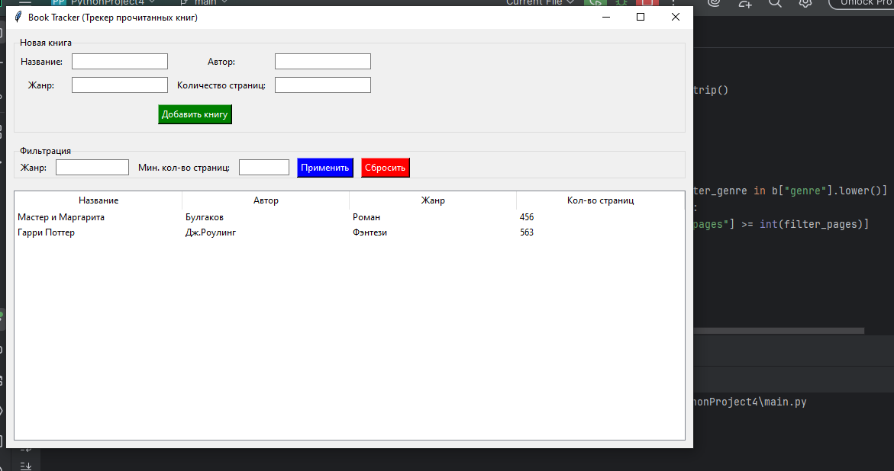

# Book Tracker - Трекер прочитанных книг

## Информация об авторе:
**Автор:** Зайцева Василиса
**Дата создания:** 03.05.2026

## Описание программы
Программа Book Tracker (Трекер прочитанных книг) - удобное приложения с графическим интерфейсом для отслеживания прочитанных книг, добавления их в список и с фильтрацие по жанру или кол-ву страниц.

### Возможности программы:
    - Добавление книг: сохранение названия, автора, жанра и количества страниц.
    - Хранение данных: автоматическое сохранение и загрузка из файла `books.json`.
    - Фильтрация: по жанру или минимальному количеству страниц.
    - Управление: кнопка сброса фильтров для возврата к полному списку.

## Проверка корректности ввода (Валидация)
В приложении реализована защита от ошибок:
1.  **Пустые поля:** программа не позволит добавить книгу, если хотя бы одно поле не заполнено.
2.  **Числовые данные:** в поле «Страницы» можно вводить только целые числа. При вводе букв приложение выведет предупреждение.

## Требования
*   **Python:** версия 3.6
*   **Библиотеки:** `tkinter`, `json`, `os` (обычно предустановлены в Python).

## 📥 Установка и запуск

1.  **Клонируйте репозиторий:**
    ```bash
    git clone https://github.com/Vasilisa-00/Book-Tracker
    ```
2.  **Перейдите в папку проекта:**
    ```bash
    cd book-tracker
    ```
3.  **Запустите программу:**
    ```bash
    python main.py
    ```
    
## Тестирование (Примеры использования)
Чтобы убедиться, что всё работает правильно, попробуйте выполнить следующие тесты:

1.  **Тест добавления:**
    *   Введите: Название "Мастер и Маргарита", Автор "Булгаков", Жанр "Роман", Страницы "480".
    *   Нажмите "Добавить". Книга должна появиться в таблице ниже.
2.  **Тест валидации:**
    *   Попробуйте оставить поле "Автор" пустым и нажать "Добавить". Вы должны увидеть окно с ошибкой.
    *   Попробуйте ввести в "Страницы" текст "много". Программа должна выдать предупреждение.
3.  **Тест фильтра:**
    *   Добавьте две книги: одну на 100 страниц, другую на 300.
    *   В поле фильтра "Мин. страниц" введите "200" и нажмите "Применить". В списке должна остаться только одна книга.
4.  **Тест сохранения:**
    *   Закройте программу и откройте её снова. Все добавленные ранее книги должны загрузиться автоматически.

**Внешний вид приложения:**
.

**Добавление данных:**
[Скриншот](bookadd.png).

**Фильтрация по жанру:**
[Скриншот](bookfilter.png)

**Фильтрация по страницам:**
[Скриншот](pagesfilterbook.png)

**Ошибка числа страниц:**
[Скриншот](errorbook1.png)

**Ошибка заполнения полей:**
[Скриншот](errorbook2.png)
